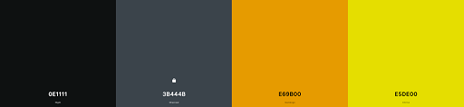
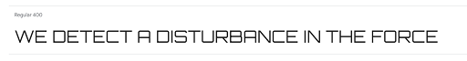

# Mindwars

## Introduction

### Link to the Game - [MindWars](https://star-wars-e347f35c852d.herokuapp.com/)

## User Experience

### Main Idea

### Project Goal

### Target Audience

### User Goals

### Site Owner Goals

### User stories

- #### First-Time Visitor Goals

- #### Returning Visitor Goals

- #### Frequent User Goals

### Owner Goals
- #### First-Time Visitor Goals

- #### Returning Visitor Goals

- #### Frequent User Goals

[Top](#mindwars)

## Design  

### Colour Scheme

- The color scheme was chosen to reflect the 'StarWars' theme.

### Typography

- The fonts for this project are from google fonts.
  - The Main Font is "Obitron" sans-serif.

  

  - the Text Font is "Star Wars" sans-serif.

  
